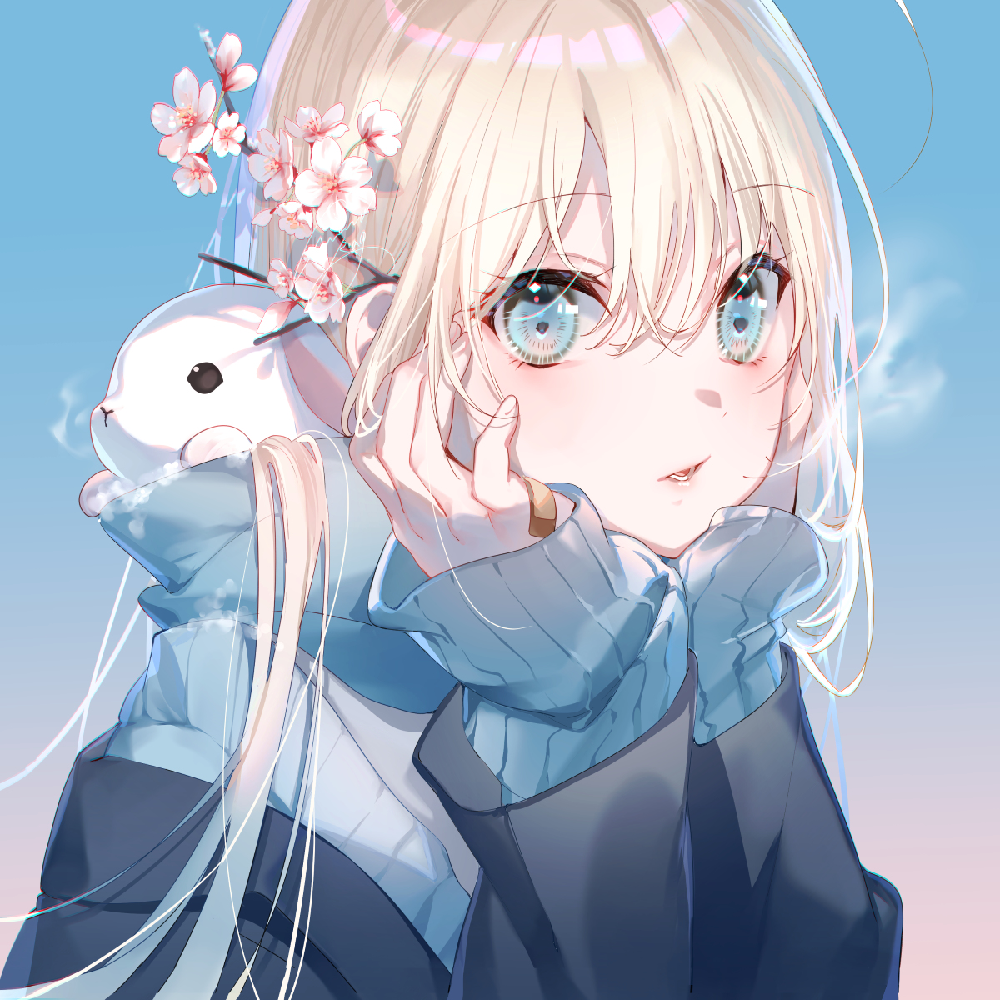
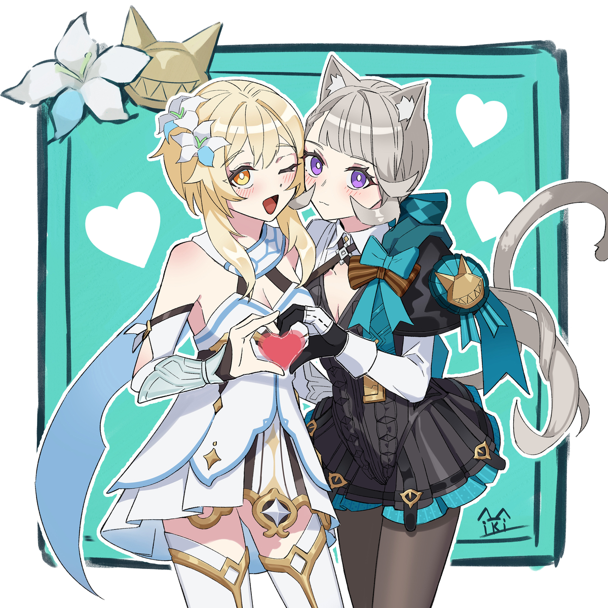
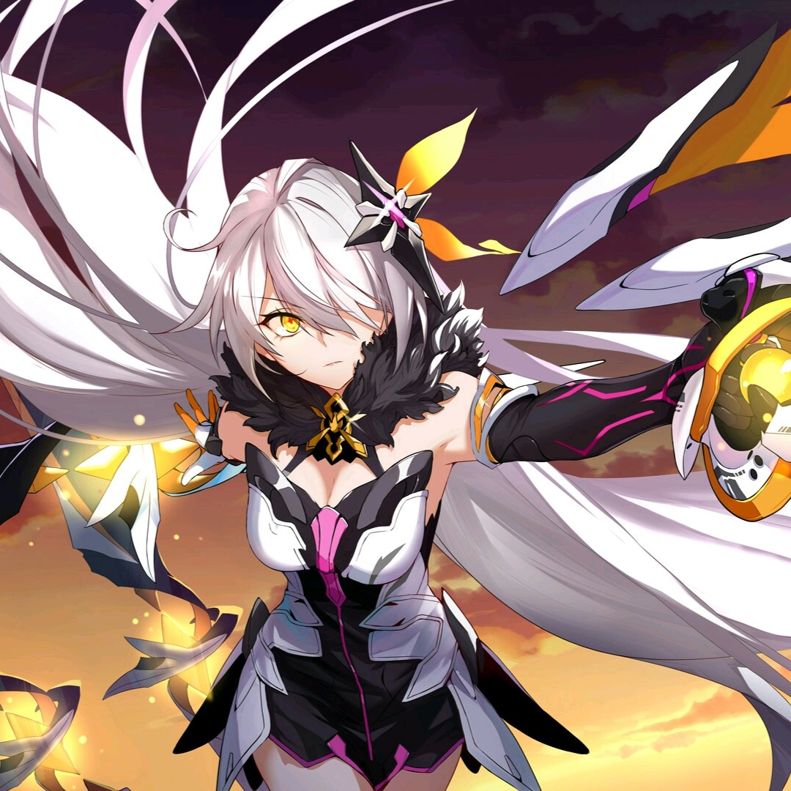
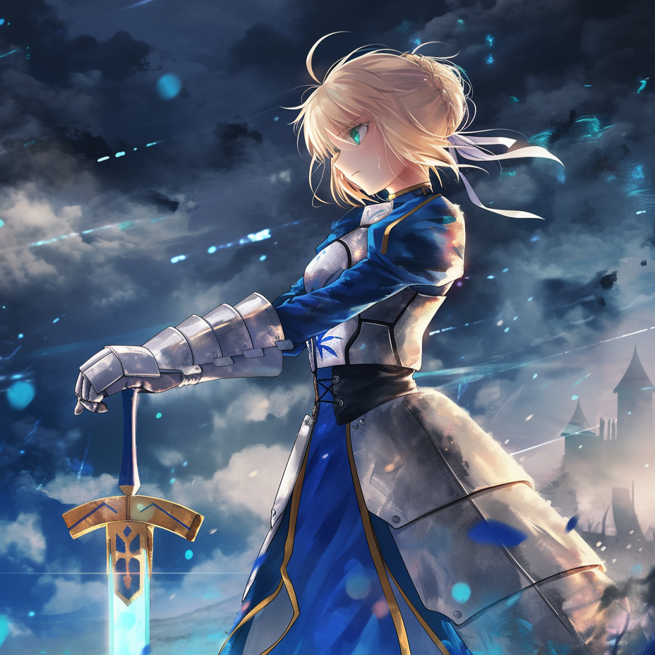
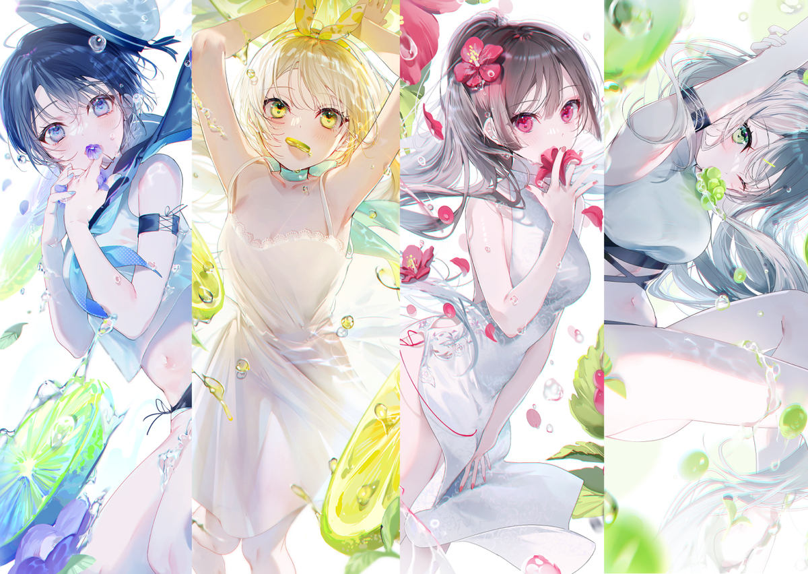

  <!-- ==================== 顶部横幅 ==================== -->
  

  <!-- 头像 -->
  <!-- 

    
  
 -->

  <!-- 动态打字效果 -->
  

  
  

  <!-- 简短介绍 -->
  

    <b>🌸 全栈开发者 | 二次元爱好者 | 开源创作者</b>
  

  

    💬 技能：<code>JavaScript/TypeScript</code> · <code>Vue</code> · <code>Node.js</code> 
    ⚡ 小趣事：我会在项目 README 里藏彩蛋（试试找找看）✨
  

  <!-- 社交链接 -->
  

    
    
    
    
  

  <!-- 访客计数器（稳定） -->
  

    
  

  <!-- 彩色分割线 -->
  

  <!-- GitHub 数据卡片 -->
  <h3>📊 我的 GitHub 数据</h3>
  

    <picture>
      <source media="(prefers-color-scheme: light)" srcset="https://pixel-profile.vercel.app/api/github-stats?username=outmirror&screen_effect=false&background=linear-gradient(to%20bottom%20right%2C%20%23ffb3d9%2C%20%234597e9)">
      <source media="(prefers-color-scheme: dark)" srcset="https://pixel-profile.vercel.app/api/github-stats?username=outmirror&screen_effect=true&background=linear-gradient(to%20bottom%20right%2C%20%235580eb%2C%20%232aeeff)">
      
    </picture>
     
    
  

  <!-- ACG 角落（精选） -->
  <h3>🎴 ACG 角落</h3>
  
我在二次元的世界里最常驻足的几处 —— 游戏 / 轻小说 / 插画。

  <table align="center">
    <tr>
      <td align="center" width="160">
        
        
<b>原神</b> <small>长期玩家，机制 / 叙事粉</small>

      </td>
      <td align="center" width="160">
        
        
<b>崩坏系列</b> <small>美术 / 剧情向</small>

      </td>
      <td align="center" width="160">
        
        
<b>Saber</b> <small>收藏中 / 灵感来源</small>

      </td>
    </tr>
  </table>

  <!-- 樱花飘分割 -->
  

  <!-- 技术栈 -->
  <h3>🛠️ 技术栈 & 工具</h3>
  

    
  

  <!-- 项目 & 链接（美化：Vue logo + 卡片） -->
  <h3>📁 项目精选</h3>

  <!-- Vue 徽章 -->
  

    

  <!-- 项目展示卡片 -->
  

  

    <b>ACG-HOME</b> — 二次元综合平台（Vue + Spring），聚合作品投稿、画廊、评论与个人收藏。收集liver信息方便快捷。
  

  <!-- 彩蛋：一个祝福 -->
  

    
🎁 彩蛋

    
愿你代码无 bug，画面常在线，二次元温柔填满每一天 ✨

  

  <!-- 开发名言 -->
  <h3>💡 开发名言</h3>
  <blockquote>
    “Talk is cheap. Show me the code.” — Linus Torvalds  
     <small>—— 代码与世界同样需要想象力 ✨</small>
  </blockquote>

  <!-- 页脚图片 -->
  

  
✨ 感谢你的来访，欢迎 star / fork / 私信交流 ✨

<!-- README 源码注释（只有查看源文件的人会看到） -->
<!--
  你已经看到了 README 的源码注释 —— 这也是一种小小的彩蛋形式。
  图片文件引用（请把这些文件放到仓库的 assets/ 目录）：
    - banner.jpg
    - avatar.jpg
    - card-gns.jpg
    - card-honkai.jpg
    - card-anime1.png
    - vue-card.png     <-- （可选，但推荐，有则更美）
    - footer.jpg
-->